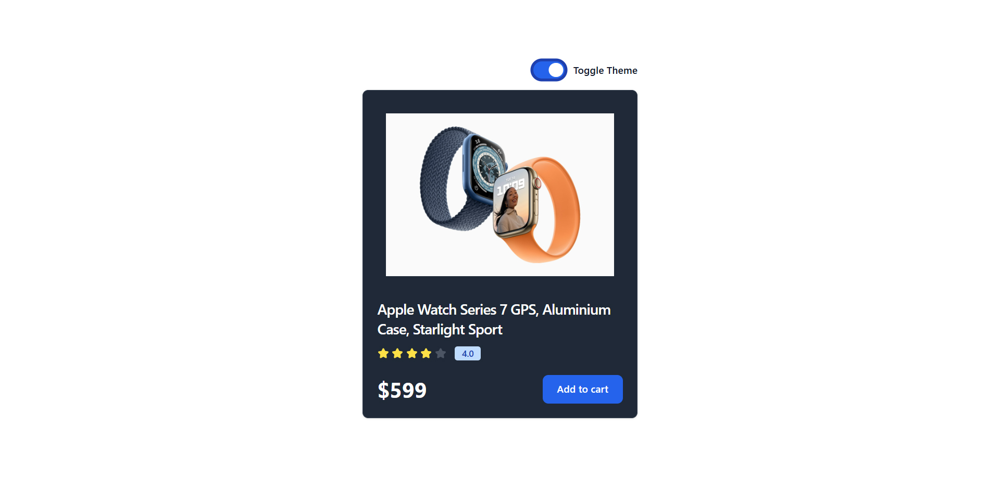

# Theme Switcher Card
Hi, this repository contains a Theme Switcher Card project built with ReactJS. The app enables users to toggle between light and dark modes for a visually customizable experience. The project utilizes React components, useContext for global state management, and hooks like useState and useEffect to handle the theme toggle functionality.

Built with:

  

## Output:

